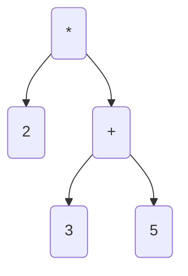

{}

Let's explore a calculator that can solve a variety of equations dynamically. We'll be able to use this solution to explore tree data structures and specifically the use of binary trees to represent and solve common math problems.

A binary tree is a data structure which represents a set of relational data in a series of nodes. Each node may have at least one **parent node** and is linked to up to two **children nodes**. The node at the beginning of the tree has no parents and is called the **root node**. The nodes at the ends of the tree have no **children nodes** and are called **leaf nodes**.

For our solution we will be creating a tree where each **leaf node** contains an integer value (like 2, 5 or 42). The nodes higher up in the tree will contain various formula that can calculate a new integer value from their **children nodes**. Using this method we can iterate over the entire tree to solve for the value at the **root node**, that value is the result of our equation.

We can turn the equation `2 * (3 + 5)` into a tree that looks like this:



Then we can attempt to solve for the value of any unknown node in the tree by evaluating the node's function with the left- and right-hand values from the children. This will allow us to identify that `2 * (3 + 5)` is `16`. This is a small example but now that we have defined the algorithm for solving these equations, we're able to parse and solve these problems automatically no matter how complex they grow to be.

### The Code

```csharp
// C# Calculator Tree - by World of Zero 
// Learn more: worldofzero.com/v/V2KwrmjNIrY
using System;

// create tree to represent:
// 2 * (3 + 5)
//
//      *
//     / \
//    2   +
//       / \
//      3   5

var calc = new Calculation() {
    LeftHandValue = new Calculation() { CurrentValue = 2 },
    RightHandValue = new Calculation() {
        LeftHandValue = new Calculation() { CurrentValue = 3 },
        RightHandValue = new Calculation() { CurrentValue = 5 },
        Function = (left, right) => left + right
    },
    Function = (left, right) => left * right
};
var result = Solve(calc);
Console.WriteLine($"2 * (3 + 5) = {result}!");

int Solve(Calculation calc)
{
    if (calc.CurrentValue.HasValue) {
        return calc.CurrentValue.Value;
    }
    if (!calc.LeftHandValue.CurrentValue.HasValue) {
        calc.LeftHandValue.CurrentValue = Solve(calc.LeftHandValue);
    }
    if (!calc.RightHandValue.CurrentValue.HasValue) {
        calc.RightHandValue.CurrentValue = Solve(calc.RightHandValue);
    }
    calc.CurrentValue = calc.Function(calc.LeftHandValue.CurrentValue.Value, calc.RightHandValue.CurrentValue.Value);
    return calc.CurrentValue.Value;
}

public class Calculation {
    public Calculation LeftHandValue { get; set; }
    public Calculation RightHandValue { get; set; }
    public int? CurrentValue { get; set; }
    public Func<int, int, int> Function { get; set; }
}
```

***

I've explored Top-Level Programs more here: https://youtu.be/uxxROAx6MMU
An intro to `dotnet watch`: https://youtu.be/nYudqdL55us
Join the World of Zero Discord Server: https://discord.gg/hU5Kq2u