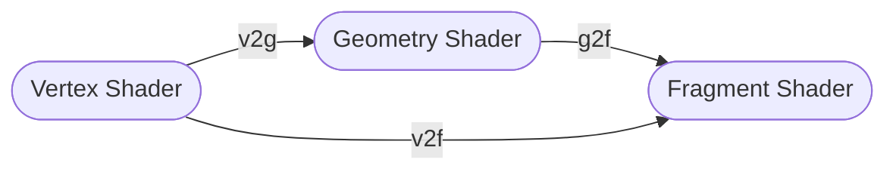

{}

Lets fix our grid snapped vertex custom shader by introducing some improved lighting. Because we're manipulating our objects geometry inside our shader the normals that are used to calculate lighting are incorrect. This causes objects to appear oddly smooth and lighting effects to look very different from what you'd expect based on the geometry you see. We can't just correct the normals of each vertex because doing that would still cause the normal value to be interpolated along each of the triangles of our mesh (causing a smoothing effect). To resolve this we're going to implement a geometry shader which allows us to dynamically recreate the mesh inside our shader so we can provide data that can be tweaked to our needs.

If present a geometry shader occurs after an a vertex shader but before the fragment shader following one of these two paths:



It is not necessary for a geometry shader to recreate the same geometry that was passed in. The output can be completely modified to introduce additional information (we've used that capability in our [Grass Shader](https://youtu.be/b2AlyCNbYmY)). In this case our needs are simpler though, we are going to be using the geometry shader to isolate each triangle of our mesh. Doing this means that we can avoid interpolation caused by multiple triangles sharing a vertices without having to make those modification in our original mesh beforehand. This allows our shader to be compatible with any shape instead of just meshes specifically designed for this effect.

Our geometry shader recreates each triangle and assigns all the vertices of that triangle a unique normal so the face has uniform lighting. We also calculate the diffuse lighting we use inside of the geometry shader and pass that information along to the fragment shader. The geometry shader we're using looks like this (assuming our vertex shader provides world space coordinates):

```shader
[maxvertexcount(3)]
void geom(triangle v2g IN[3], inout TriangleStream<g2f> triStream)
{
    float3 lightPosition = _WorldSpaceLightPos0;

    float3 v0 = IN[0].pos.xyz;
    float3 v1 = IN[1].pos.xyz;
    float3 v2 = IN[2].pos.xyz;
    float3 normal = normalize(cross(v0 - v1, v1 - v2));

    float lightStrength = (dot(lightPosition, normal) + 1) / 2;

    g2f OUT;
    OUT.norm = normal;
    OUT.lightStrength = lightStrength;

    OUT.pos = mul(UNITY_MATRIX_VP, IN[0].pos);
    triStream.Append(OUT);

    OUT.pos = mul(UNITY_MATRIX_VP, IN[1].pos);
    triStream.Append(OUT);

    OUT.pos = mul(UNITY_MATRIX_VP, IN[2].pos);
    triStream.Append(OUT);
}
```

***

My intro to exploring Geometry Shaders: https://youtu.be/HY6qFbmbij8
My video covering implementing diffuse lighting in more detail: https://youtu.be/4XfXOEDzBx4
A collection of other visual effects we've built: https://www.youtube.com/watch?v=l_2uGpjBMl4&list=PLEwYhelKHmig6ttzH0nRL3OOQsGLtVrtX
Watch the entire series where we explore this concept of snapping vertices to a grid: https://www.youtube.com/watch?v=e8NItqF_9hQ&list=PLEwYhelKHmiixWR3Tn5dYt1iUlSCL6OFq
Join the World of Zero Discord Server: https://discord.gg/hU5Kq2u