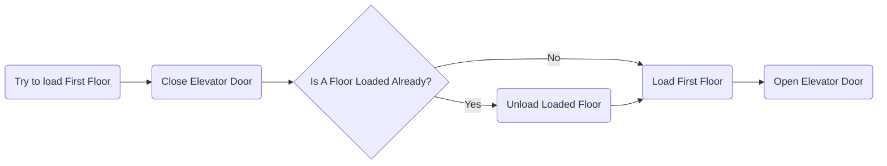

{}

Continuing our elevator and asynchronous scene management system development let's try to build a 3-scene system that will allow us to create a base scene with the global game objects (our player, scene transition elevator, camera etc) and the two "floors" we'll be transitioning between.

Our goal is to unload the currently loaded floor (if one is loaded) and replace it with the new scene before opening the elevator to reveal the changed scene. If we were to reverse this order or tried to unload and load the scenes simultaneously, we could end up in a situation where both of our playable scenes were loaded at the same time. For a completely static scene this is probably fine, but any dynamic objects like physics, ai etc could potentially attempt to interact with the other scene and cause behavior we don't want.

The flow we're trying to create with this effect should look something like this.

***

The [**Elevator Between Scenes** series playlist](https://www.youtube.com/playlist?list=PLEwYhelKHmigCVDWNM5--f7PofdkvXbuZ)
Join the World of Zero Discord Server: https://discord.gg/hU5Kq2u