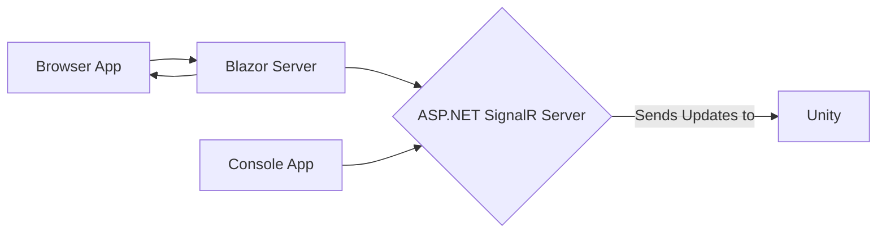

{}

Let's complete our SignalR in Unity experiment by adding a Blazor Website to it. This will allow us to use a browser to send messages directly to Unity to create updates instead of either needing to install a Unity game or run a console app. We'll quickly cover some of the components in a Blazor website as well as how some of the architecture works.

We'll take a quick detour to chat about Blazor Web Assembly (Blazor WASM) vs Blazor Server because I completely forgot what project template I chose when setting up this test project. 😅

The architecture of our app looks like this:



You can create a new Blazor project using either:

### Blazor Web Assembly

```sh
dotnet new blazorwasm
```

or 

### Blazor Server

```sh
dotnet new blazorserver
```

If you want to learn more about Blazor you can get started here: https://aka.ms/getstartedwithblazor

***

If you would like to get started learning SignalR you can learn more at https://aka.ms/getstartedsignalr

My previous SignalR series shared at the [Microsoft Reactor](https://www.youtube.com/c/MicrosoftReactor1/) where we created an interactive canvas you could collaboratively draw on with the rest of the world!

1. [Building Real-Time Web Apps with SignalR](https://www.youtube.com/watch?v=k5rdhYj6TB8)
2. [Connecting a Web App to SignalR](https://www.youtube.com/watch?v=c0zmYjQ8KWA)
3. [Creating a Real-Time Web Canvas](https://www.youtube.com/watch?v=hgq1CYEJg_Q)

You can see some of the other content I have planned outside this channel in the Microsoft Reactor (and even come to our in-person events) at the [Microsoft Reactor San Francisco Meetup Page](https://www.meetup.com/Microsoft-Reactor-San-Francisco/).

***

Join the World of Zero Discord Server: https://discord.gg/hU5Kq2u